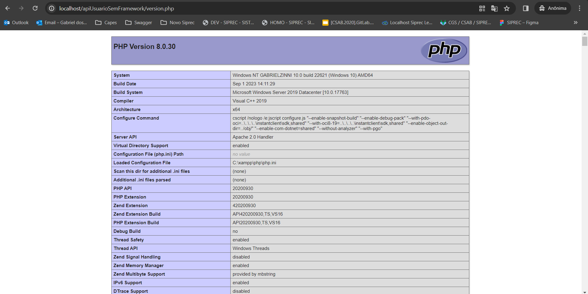
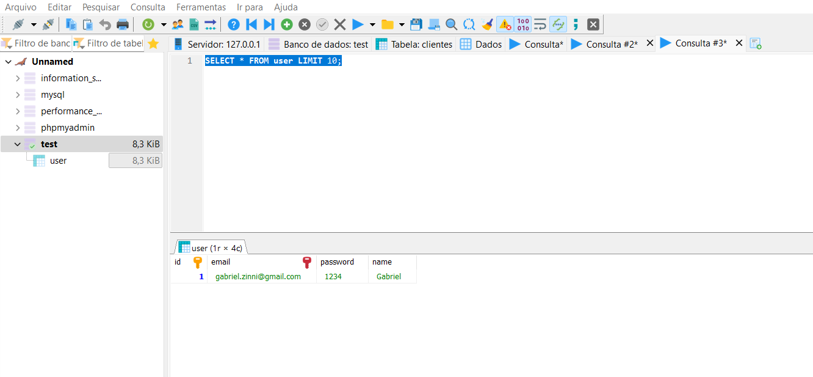

# API Usuario

Para começar, estamos usando Windows com XAMPP para essa API, quando baixar o projeto, verificar se o version do PHP carrega perfeitamente, URL "http://localhost/apiUsuarioSemFramework/version.php":

 
Verificar o arquivo db.sql para criação da tabela "user" para testar:

Informações:

*GET* /users: Retorna a lista de todos os usuários.
*GET* /users/{id}: Retorna os detalhes de um usuário específico.
*POST* /users: Cria um novo usuário.
*PUT* /users/{id}: Atualiza os dados de um usuário existente.
*DELETE* /users/{id}: Remove um usuário existente.

